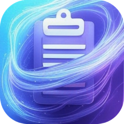

# CleanCopy



CleanCopy is a simple macOS utility designed to help manage and clean up clipboard history or temporary files. (Please update this description with the actual app details).

## Building the Application

This project uses a `Makefile` to simplify common development tasks.

### Prerequisites

*   Xcode and Command Line Tools
*   For packaging (`make package`): `create-dmg` (Install via Homebrew: `brew install create-dmg`)

### Makefile Commands

*   **`make build`** (or just `make`)
    Builds the Debug configuration of the application. The output `.app` file will be located in `./build/Build/Products/Debug/`.

*   **`make package`**
    Builds the Debug configuration (if not already built) and then packages the application into a distributable DMG file named `CleanCopy.dmg` in the project root directory.
    *Requires `create-dmg` to be installed.*

*   **`make clean`**
    Removes the build directory (`./build`) and the generated DMG file (`CleanCopy.dmg`).

## License

This project is licensed under the MIT License.

```
MIT License

Copyright (c) [year] [copyright holder]

Permission is hereby granted, free of charge, to any person obtaining a copy
of this software and associated documentation files (the "Software"), to deal
in the Software without restriction, including without limitation the rights
to use, copy, modify, merge, publish, distribute, sublicense, and/or sell
copies of the Software, and to permit persons to whom the Software is
furnished to do so, subject to the following conditions:

The above copyright notice and this permission notice shall be included in all
copies or substantial portions of the Software.

THE SOFTWARE IS PROVIDED "AS IS", WITHOUT WARRANTY OF ANY KIND, EXPRESS OR
IMPLIED, INCLUDING BUT NOT LIMITED TO THE WARRANTIES OF MERCHANTABILITY,
FITNESS FOR A PARTICULAR PURPOSE AND NONINFRINGEMENT. IN NO EVENT SHALL THE
AUTHORS OR COPYRIGHT HOLDERS BE LIABLE FOR ANY CLAIM, DAMAGES OR OTHER
LIABILITY, WHETHER IN AN ACTION OF CONTRACT, TORT OR OTHERWISE, ARISING FROM,
OUT OF OR IN CONNECTION WITH THE SOFTWARE OR THE USE OR OTHER DEALINGS IN THE
SOFTWARE.